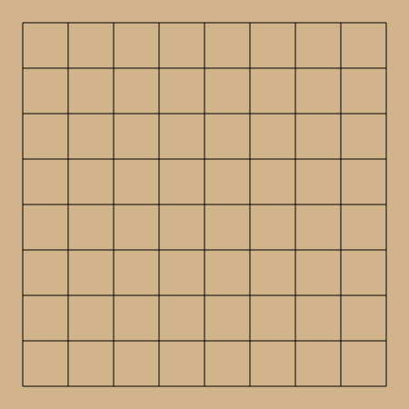

# GitHub Go Game

## How to Play
- To play a move, comment on the latest move issue with your move (e.g., `move C5`).
- Black and white stones will alternate automatically.

### Example Moves
- `move C5` (places a stone on column C, row 5)
